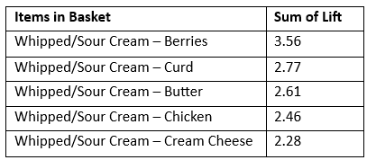

---
runme:
  id: 01HV4S8PFXQ3ZM0FKDQH6M8SXF
  version: v3
---

# Market Basket Analysis Dashboard

Welcome to Market Basket Analysis Power BI dashboard repository! This README serves as a guide to understanding the insights provided by dashboard and how to effectively utilize it for gaining valuable information on customer purchasing behavior.

## About the Dashboard

Market Basket Analysis dashboard utilizes data analytics techniques to uncover associations between products frequently bought together by customers. By leveraging this analysis, businesses can make informed decisions regarding cross-selling, upselling, and optimizing product placements to enhance sales and customer satisfaction.

## How does the Basket Analysis Works?

Basket Analysis operates by calculating three essential metrics for each product association: support, confidence, and lift.

•	Support: Indicates the frequency of a specific combination of products being purchased together.

•	Confidence: Measures the likelihood of buying the second product when the first product is already in the basket.

•	Lift: Demonstrates the strength of the relationship between two products in a basket, indicating whether they are bought together more frequently than by chance.

## Project Overview

The project involved obtaining data, transforming it using Power Query, and loading it into Power BI for analysis. I cleaned the data, computed key metrics, and visualized the insights to create an interactive dashboard.

## Getting Started

To utilize the Basket Analysis dashboard effectively, follow these steps:

1. Clone or Download: Clone or download this repository to your local machine.
2. Open the Dashboard: Locate the Power BI file (*.pbix) in the repository and open it using Power BI Desktop.
3. Data Connection: Connect the dashboard to your dataset or use the sample dataset provided.
4. Explore Insights: Navigate through the interactive visualizations to uncover associations between products and gain valuable insights into customer purchasing behavior.
5. Utilize the Recommendations: Use the insights provided by the dashboard to inform product placement, pricing strategies, and recommendations to customers.

## Sample Data

I have included a sample dataset in the repository to facilitate exploration and understanding of the dashboard. Below is a snippet of the first 10 rows of the sample data:

This dataset represents the first 10 transactions with associated items. Each row corresponds to a transaction, and the items purchased in that transaction are listed.

This data set is taken from kaggle and also available in the repository.

## DAX used for Calculated Colomns

DAX (Data Analysis Expressions)
Data Analysis Expressions (DAX) were used to compute key metrics such as support, confidence, and lift for Market Basket Analysis. The following steps outline the DAX calculations used in our dashboard:

1. Support Calculation: Calculate the support metric, representing the frequency of specific product combinations in transactions.
2. Confidence Calculation: Compute the confidence metric, indicating the likelihood of purchasing one product given the presence of another product in the basket.
3. Lift Calculation: Determine the lift metric, measuring the strength of the relationship between two products in a basket.

**Note**: All the calculated DAX is available in a separate file in Repository.

## Findings

Analysis reveals several noteworthy insights, including strong associations between certain products and recommendations for product placement and promotional strategies.

For example:
Here is an association between Whipped Cream and its lift values respective to various products.

## Recommendation

Based on our analysis, we recommend the following actions for optimizing sales and customer satisfaction:

•	Product Placement: Place products with strong associations in close proximity to each other to encourage cross-selling.

•	Promotional Strategies: Offer discounts and promotions for products frequently bought together to incentivize customers.

•	Online Recommendations: Recommend associated products to online shoppers based on their cart contents to enhance their shopping experience.

## Challenges

Throughout the project, I encountered several challenges that tested my skills and problem-solving abilities. One of the main hurdles was the transformation of raw data into a format suitable for analysis. The dataset's structure presented complexities that required careful handling and manipulation. To overcome this challenge, I employed various techniques such as data reshaping and cleaning to ensure accurate insights.

Additionally, writing DAX expressions for calculating key metrics posed another challenge. The syntax and logic required for DAX calculations were initially complex for me to grasp. To address this, I extensively researched DAX functions and expressions, sought guidance from online resources, and experimented with different approaches until I achieved the desired results. Through perseverance and continuous learning, I gained proficiency in utilizing DAX for effective data analysis and visualization.

Despite these challenges, tackling them provided valuable learning opportunities and enhanced my skills in data analysis and Power BI dashboard development.

## Support and Feedback

If you encounter any issues or have feedback regarding this Market Basket Analysis dashboard, please feel free to reach out to me.
